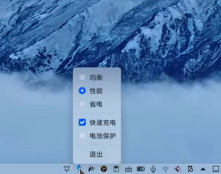
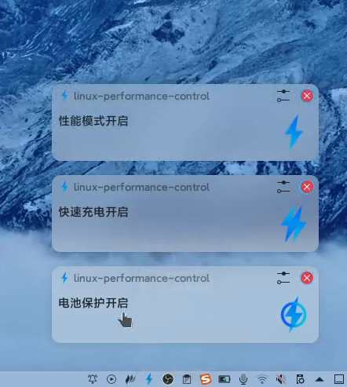

# linux-performance-control


##  警告!

请确保你的电脑是`联想小新15 2021 锐龙版`

此软件需要**Root权限**,可能会对你的电脑造成不可逆转的伤害(**也许吧**)

## 啰嗦的介绍

linux性能管理是为了在linux笔记本下进行控制性能和电源而写的。
我的电脑是`联想小新15 2021 锐龙版`,在Windows下联想提供了电脑管家可以进行性能控制,不幸的是,他不支持Linux。😭
后来我在[archlinux wiki](https://wiki.archlinux.org/title/Lenovo_IdeaPad_5_15are05)上找到了解决方案。利用`acpi_call`,可以在Linux上实现联想电脑管家的性能功能。
为了让操作更直观方便,我用开始用pyqt写了一个托盘程序[tray-battmngr](https://github.com/xushengfeng/tray-battmngr),但界面效果不理想。后来我用:electron:重写,也就有了本仓库。

## 使用

直接在右边releases上下载最新的包

```shell
# 如果你的系统是Ubuntu或Debian系
sudo dpkg -i linux-performance-control_2.0.1_amd64.deb

# 如果你的系统是Arch Linux或manjaro
# 首先安装acpi_call（acpi_call用于官方内核acpi_call-lts用于 LTS 内核，acpi_call-dkms用于其他内核）
sudo pacman -S acpi_call
# 建议安装electron
sudo pacman -S electron
sudo pacman -U linux-performance-control-2.0.1.pacman
```


克隆本仓库并进入。在仓库目录下执行`npm install electron`以安装electron。然后执行`npm install`进行安装,最后执行`npm start`启动linux-performance-control。







## 下一步
- [x] 打包成应用
- [x] 通知加入图标

## PS
本软件在`联想小新15 2021 锐龙版` `Arch Linux`下测试通过,但很大概率不适合其他联想笔记本😜。据说kde将在未来加入性能管理,还是期待他吧。
